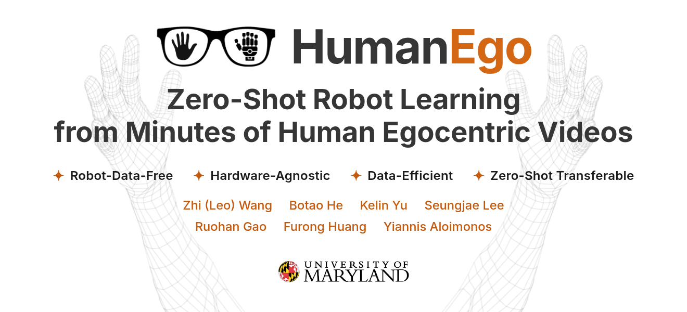

<p align="center">
  <a href="https://humanego-ai.github.io">
    
  </a>
</p>

<p align="center">
  <a href="https://tx-leo.github.io">Zhi (Leo) Wang</a> &nbsp;·&nbsp;
  <a href="https://bottle101.github.io/">Botao He</a> &nbsp;·&nbsp;
  <a href="https://colinyu1.github.io/">Kelin Yu</a> &nbsp;·&nbsp;
  <a href="https://sjlee.cc/">Seungjae Lee</a> &nbsp;·&nbsp;
  <a href="https://ruohangao.github.io/">Ruohan Gao</a> &nbsp;·&nbsp;
  <a href="https://furong-huang.com/">Furong Huang</a> &nbsp;·&nbsp;
  <a href="https://robotics.umd.edu/clark/faculty/350/Yiannis-Aloimonos">Yiannis Aloimonos</a>
</p>

<p align="center">
  <a href="https://humanego-ai.github.io"></a>
  &nbsp;
  <a href="https://arxiv.org/pdf/2605.24934"></a>
  &nbsp;
  <a href="https://arxiv.org/abs/2605.24934"></a>
  &nbsp;
  <a href="https://youtu.be/pdL46diijuY"></a>
  &nbsp;
  <a href="#bibtex"></a>
</p>

---

## Overview

<p align="center">
  
</p>

---

## Installation

```bash
git clone https://github.com/TX-Leo/HumanEgo.git
cd HumanEgo
conda create -n humanego python=3.11 -y
conda activate humanego
bash setup.sh
```

This installs PyTorch (with CUDA), the vision foundation models we use
(SAM 2, Grounding DINO, CoTracker, Orient-Anything V2), and the hand-tracking
methods (MediaPipe, WiLoR, HaMeR).

---

## Quick Start

The fastest way to run the whole pipeline end-to-end — download, preprocess, and
train on just a couple of recordings. The `HumanEgo` training job holds out the
first recording (`mps_serve_bread_000_vrs`) for evaluation and trains on the
rest, so download two.

**1. Download two recordings** — inputs only, ~1.2 GB

```bash
pip install huggingface_hub
python scripts/download_data.py --task serve_bread --num 2 --input-only
```

Fetches `mps_serve_bread_000_vrs` and `mps_serve_bread_001_vrs` into
`./data/serve_bread/aria/`, skipping the precomputed `preprocess/` output so you
run the pipeline yourself. See
[Download the released data](#download-the-released-data) for more options.

**2. Preprocess both**

```bash
python -m preprocess.Preprocess --mps_path ./data/serve_bread/aria/mps_serve_bread_000_vrs --task serve_bread
python -m preprocess.Preprocess --mps_path ./data/serve_bread/aria/mps_serve_bread_001_vrs --task serve_bread
```

Regenerates each recording's `preprocess/` folder. See [Preprocess](#preprocess)
for details.

**3. Train**

```bash
python -m training.FlowMatchingTrainer --task serve_bread --use_cfg --job HumanEgo
```

Trains on `mps_serve_bread_001_vrs` and evaluates on the held-out
`mps_serve_bread_000_vrs` (config: `cfg/training/serve_bread/HumanEgo.yaml`).
See [Training](#training) for details.

---

## Data Collection

<p align="center">
  
</p>

To apply for the Meta Project Aria glasses, see
[projectaria.com/glasses](https://www.projectaria.com/glasses/).

See [`datacollection/README.md`](datacollection/README.md)
for the end-to-end guide on recording your own Project Aria data and running
MPS (SLAM + hand tracking) on it. The resulting data should look like this:

```
- data
    - mps_TEST_vrs/
        - else
            - sample.vrs.json
            - vrs_health_check.json
            - vrs_health_check_slam.json
        - hand_tracking
            - hand_tracking_results.csv
            - summary.json
        - slam
            - closed_loop_trajectory.csv
            - online_calibration.jsonl
            - open_loop_trajectory.csv
            - semidense_observations.csv.gz
            - semidense_points.csv.gz
            - summary.json
        - sample.vrs
```

### Download the released data

The HumanEgo dataset (raw Aria recordings + MPS-processed annotations) is hosted on the
public HuggingFace dataset
[`Leo-TX/HumanEgo`](https://huggingface.co/datasets/Leo-TX/HumanEgo) — no login or token
required. A sample recording is available now so you can test the pipeline end-to-end:

```bash
pip install huggingface_hub

# one serve_bread recording (default), with precomputed output (~2 GB, auto-extracted)
python scripts/download_data.py

# the first 20 serve_bread recordings (use --task all / --num all for everything)
python scripts/download_data.py --task serve_bread --num 20

# input only (~0.6 GB), to run preprocessing yourself
python scripts/download_data.py --input-only
```

Pick the task with `--task {serve_bread,water_flowers,all}`, the count with `--num N|all`,
and the destination with `--out <dir>`. See [`preprocess/README.md`](preprocess/README.md)
for all options, the full output-file reference, and a plain-`huggingface_hub` recipe.

---

## Preprocess

<p align="center">
  
</p>

After downloading the sample (see [Download the released data](#download-the-released-data)
above), run the full pipeline on it:

```bash
python -m preprocess.Preprocess \
    --mps_path ./data/serve_bread/aria/mps_serve_bread_000_vrs --task serve_bread
```

This regenerates everything under `…/preprocess/`. To compare against the precomputed
output instead of running the GPU pipeline, grab it with
`python scripts/download_data.py --task serve_bread --num 1`. See
**[`preprocess/README.md`](preprocess/README.md)** for the full data layout and download options.

---

## Training

<p align="center">
  
</p>

```bash
python -m training.FlowMatchingTrainer --task "YOUR_TASK" --use_cfg --job "YOUR_JOB"
```

`--task` selects a folder under `cfg/training/` (e.g. `serve_bread`) and
`--job` selects a YAML inside it (e.g. `HumanEgo`, resolving to
`cfg/training/serve_bread/HumanEgo.yaml`).

---

## Inference

> **TODO** — documentation coming soon.

---

## TODO

We are actively releasing the following — check back soon.

- [ ] Release a 3-minute quick-start tutorial
- [ ] Release a sample human-egocentric dataset (for end-to-end testing)
- [ ] Release a pretrained model (for inference demo)
- [ ] Release documentation for **Preprocessing**
- [ ] Release documentation for **Training**
- [ ] Release documentation for **Inference**

---

## Acknowledgements

This project builds on excellent open-source work, including
[Project Aria](https://www.projectaria.com/) (Gen 1 glasses &amp;
[MPS](https://facebookresearch.github.io/projectaria_tools/docs/intro)),
[Trossen Arm](https://www.trossenrobotics.com/),
[CoTracker3](https://github.com/facebookresearch/co-tracker),
[Grounding DINO](https://github.com/IDEA-Research/GroundingDINO),
[SAM 2](https://github.com/facebookresearch/sam2),
[HaMeR](https://github.com/geopavlakos/hamer),
[WiLoR](https://github.com/rolpotamias/WiLoR),
[MediaPipe](https://github.com/google-ai-edge/mediapipe),
[LaMa](https://github.com/advimman/lama),
and [Orient-Anything](https://github.com/SpatialVision/Orient-Anything).

---

<h2 id="bibtex">BibTeX</h2>

```bibtex
@misc{humanego2026,
  title         = {HumanEgo: Zero-Shot Robot Learning from Minutes of Human Egocentric Videos},
  author        = {Wang, Zhi and He, Botao and Yu, Kelin and Lee, Seungjae and Gao, Ruohan and Huang, Furong and Aloimonos, Yiannis},
  year          = {2026},
  eprint        = {2605.24934},
  archivePrefix = {arXiv},
  primaryClass  = {cs.RO}
}
```
